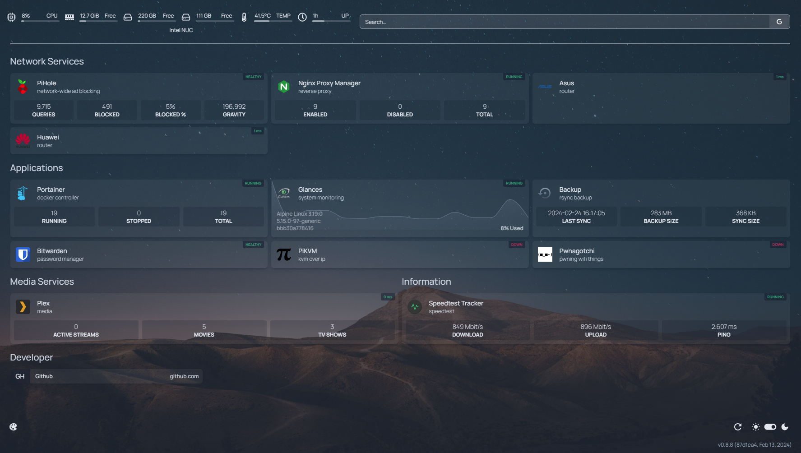

# Homepage: Application Dashboard

## Overview
Homepage is a modern, fully static, fast, and secure application dashboard. It serves as a centralized hub for managing various services and integrates with over 100 different services. With support for multiple languages and extensive customization options, Homepage provides a versatile solution for users seeking an intuitive dashboard experience.



## Documentation
Explore the Homepage documentation for detailed information and usage instructions:

- [Homepage Widgets Documentation](https://gethomepage.dev/latest/widgets/)
- [Dashboard Icons Repository](https://github.com/walkxcode/dashboard-icons/blob/main/ICONS.md)
- [Material Design Icons Library](https://pictogrammers.com/library/mdi/)

## Setup
Copy `.env.example` to `.env` and add your credentials to configure the application.

To run Homepage, execute:
```
make run
```

## Settings

### Customization
To tailor Homepage to your specific requirements, start by customizing the configuration in [config/services.yaml](config/services.yaml).

### Published Ports
The following port is published:
- HTTP: 3000
  
## Note
- Homepage offers a vast array of features, including support for multiple languages, seamless integration with numerous services, and extensive customization capabilities.
- Utilize the provided documentation to explore widgets, icons, and other customization options available in Homepage.
- For any inquiries or assistance, refer to the documentation or community support channels.
