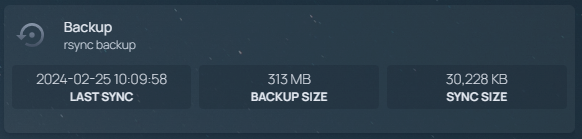

# Static File Server

## Overview
This container serves as a simple Nginx server configured to host static files from the `./static` folder. It is primarily utilized by the [backup](../backup) script to generate a static JSON file containing details of the last rsync operation. The generated JSON file is then accessed by the [Homepage](../homepage) dashboard through a simple GET request, enabling the display of data in a widget.

## Usage
1. Ensure your static files are placed in the `./static` folder.
2. Run the container to start the Nginx server using `make run`.
   
## Integration with Backup Script
The container is integrated with the backup script to facilitate the creation of a static JSON file containing rsync details. This JSON file serves as a data source for the Homepage dashboard widget.

## Note
- This container provides a lightweight and efficient solution for serving static files.
- Ensure proper configuration of the backup script to utilize the generated JSON file effectively.
- Customize the Nginx configuration as needed to accommodate specific requirements.
- For any inquiries or assistance, refer to the project documentation or community support resources.
